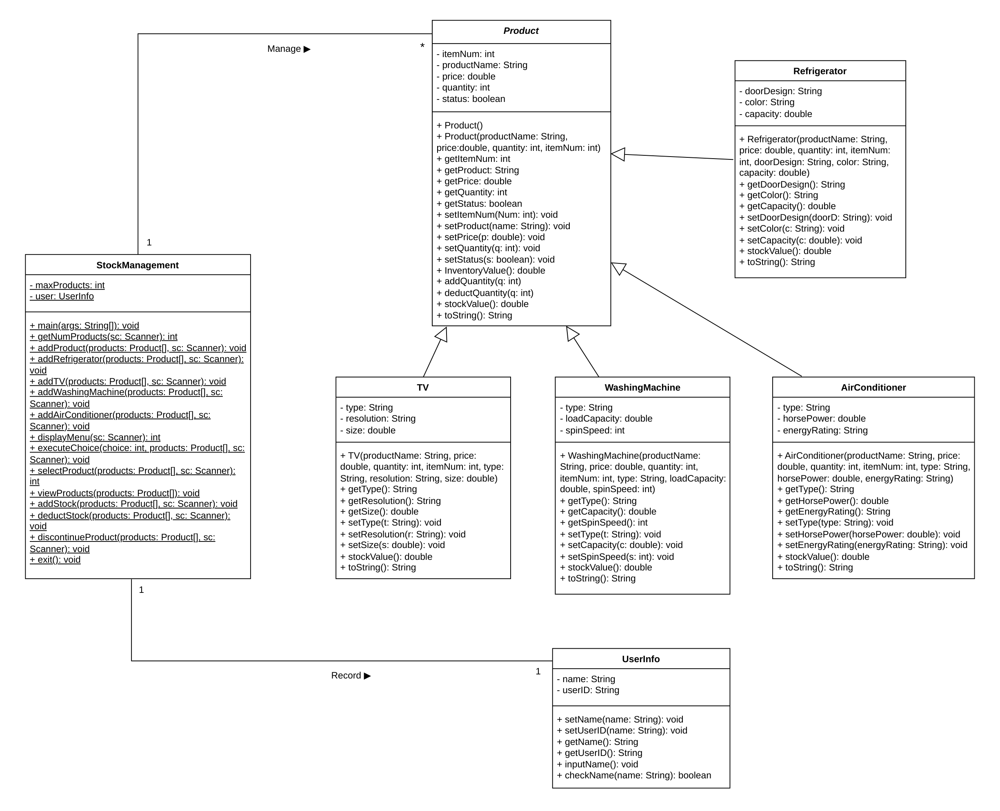
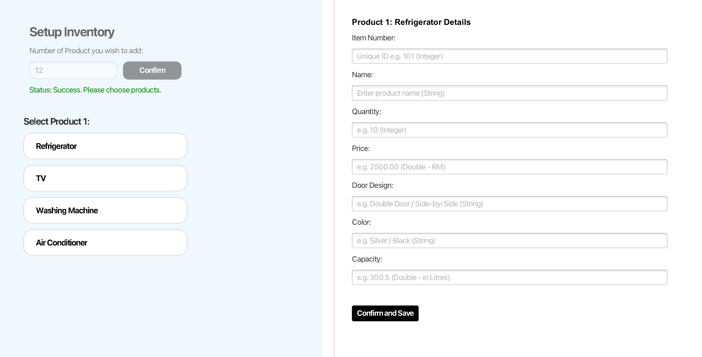
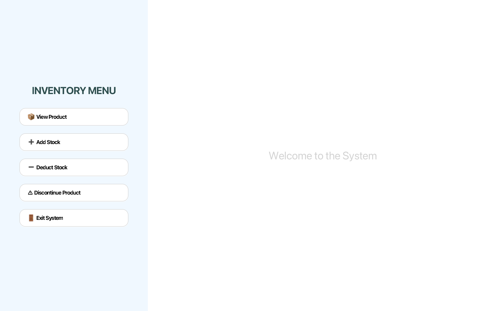
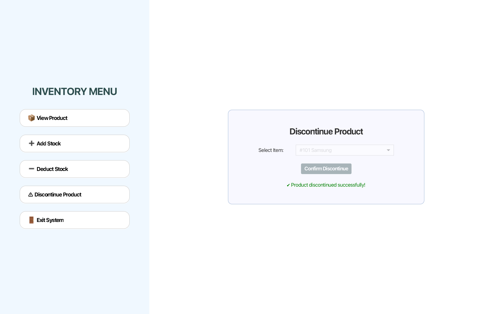
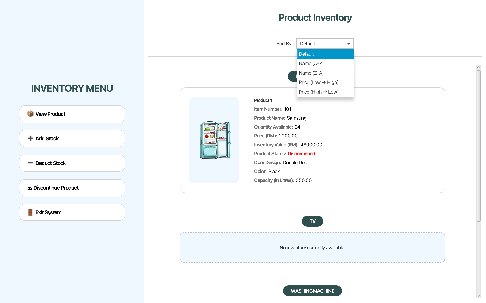

# Stock Management System

A JavaFX desktop application for managing household appliance inventory. The system enables users to manage products, monitor stock levels, and perform inventory operations through an intuitive graphical user interface. The project demonstrates object-oriented programming principles, JavaFX GUI development, and inventory management workflows.

---

## 📌 Project Overview
A JavaFX desktop application for managing household appliance inventory. The system allows users to manage products, track stock levels, and perform inventory operations through a graphical user interface.

---

## 💼 Business Impact
This application helps small retailers and warehouse operators manage household appliance inventory more efficiently. By providing centralized inventory tracking, real-time stock updates, and product categorization, the system reduces manual inventory errors and improves stock visibility for daily operations.

---

## 🛠️ Technologies & Tools

### Programming Language
- Java

### GUI Framework
- JavaFX

### Development Tools
- Eclipse IDE

### Concepts
- Object-Oriented Programming (OOP)
- Inheritance
- Polymorphism
- Encapsulation
- Java Collections
- Event-Driven Programming
- Exception Handling

---

## 🏗️ System Design

The application follows object-oriented programming principles with inheritance and polymorphism to model different appliance categories while promoting code reusability.

### UML Class Diagram

---

## 🔒 User Authentication

The application provides a secure login interface to ensure only authorized users can access the inventory management system.

### Features

- Staff authentication
- Personalized welcome message
- Real-time date and time display
- Invalid login validation

---

## ➕ Product Management

The system allows users to create and manage different categories of household appliances.

### Supported Product Categories

- Refrigerator
- Television
- Washing Machine
- Air Conditioner

Each appliance stores its own specialized information, demonstrating the use of inheritance and polymorphism.

---

## 📈 Inventory Operations

Users can efficiently maintain inventory using built-in stock management features.

### Features

- Add new products
- Edit existing products
- Increase stock quantity
- Decrease stock quantity
- Prevent negative stock values
- Remove products
- Mark products as discontinued

---

## 🚫 Product Discontinuation

Products that are no longer available can be marked as discontinued.

### Features

- Visual discontinued indicator
- Prevent further inventory modifications
- Improve inventory tracking

---

## 🔍 Product Search & Sorting

The application provides sorting functionality to help users quickly locate products.

### Features

- Sort by Product Name (A → Z)
- Sort by Product Name (Z → A)
- Sort by Price (Low → High)
- Sort by Price (High → Low)

---

## 🚪 Session Management

The application provides a clean logout and exit workflow.

### Features

- Session termination
- Exit confirmation
- User summary display

---

## 🧠 Technical Skills Demonstrated

### Programming

- Java
- JavaFX

### Software Engineering

- Object-Oriented Programming
- GUI Development
- Event-Driven Programming
- Exception Handling

### OOP Concepts

- Inheritance
- Polymorphism
- Encapsulation
- Class Design

### Application Development

- User Authentication
- Inventory Management
- Product Categorization
- Sorting Algorithms
- Input Validation

---

## 🚀 Future Improvements

- Integrate a MySQL database
- Implement barcode scanning
- Support multiple user roles
- Generate sales and inventory reports
- Add product search functionality
- Export inventory data to Excel or PDF
- Implement inventory history and audit logs

---

## 👤 Author

**Boon Jia Xuan**

Bachelor of Computer Science (Honours)

Universiti Tunku Abdul Rahman (UTAR)
