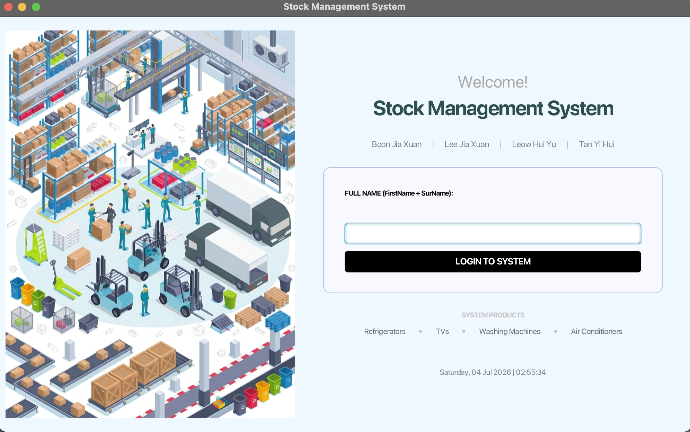

# Stock Management System

## Overview
A JavaFX desktop application for managing household appliance inventory. The system allows users to manage products, track stock levels, and perform inventory operations through a graphical user interface.

## Class Diagram

## Key Features
* **🔒 User Authentication & Login**
  * Features a polished welcome screen with an active real-time date and time display.
  * Validates full names against system records to prevent unauthorized access and dynamically greets authenticated staff.

* **⚙ Dynamic Inventory Initialization**
  * Allows administrators to configure the exact size of the incoming batch before adding stock, preventing array indexing errors and managing system memory efficiently.

* **📋 Specialized Product Categorization**
  * Supports dedicated data tracking custom-tailored to different types of home appliances:
    * **Refrigerators:** Tracks door design, color casing, and capacity in liters.
    * **TVs:** Tracks screen panel types (LED/OLED), resolution outputs, and display dimensions in inches.
    * **Washing Machines:** Tracks weight load capacity in kg, machine type, and spin speeds (RPM).
    * **Air Conditioners:** Tracks cooling type, system horsepower, and energy star efficiency ratings.

* **📦 Smart Inventory Dashboard**
  * **Interactive Product Browser:** Instantly displays all tracked items in clean visual UI cards featuring smooth hovering drop-shadow effects.
  * **Advanced Sorting:** Allows real-time filtering of inventory by product name (A-Z / Z-A) or price metrics (Low → High / High → Low).
  * **Real-Time Stock Modification:** Effortlessly increment or decrement stock quantities with built-in safeguards to catch negative numbers or insufficient stock errors.
  * **Product Discontinuation:** Mark out-of-production appliances as "Discontinued" to immediately flag them visually in red and lock them from future modifications.

* **🚪 Clean Session Termination**
  * Provides a beautiful application exit layout summarizing the active user's details and safely closing down the inventory thread session.

## Preview

## Technologies Used
- Java
- JavaFX
- Eclipse IDE

## Team Members
* Boon Jia Xuan
* Lee Jia Xuan
* Leow Hui Yu
* Tan Yi Hui
